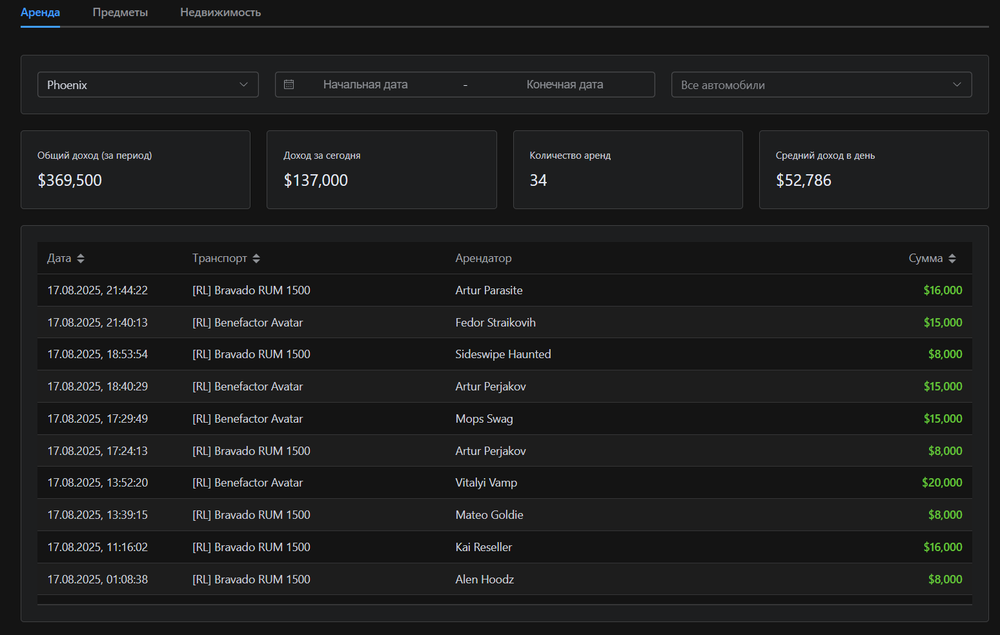

# Majestic Finance Analytics



**Majestic Finance Analytics** — это веб-инструмент для анализа и визуализации ваших доходов от аренды транспорта и других активностей на серверах Majestic RP. Загрузите свою историю чата, и приложение автоматически построит интерактивный дашборд с детальной статистикой.

Весь анализ происходит **полностью в вашем браузере**. Ваши данные никогда не покидают ваш компьютер, что гарантирует 100% приватность.

**[Попробовать вживую!](https://majestic-finance-analytics.vercel.app/)**

---

## ✨ Возможности

-   **Интерактивный дашборд:** Наглядные графики и таблицы для анализа доходов.
-   **Фильтрация и сортировка:** Анализируйте данные по серверам, датам и конкретным транспортным средствам.
-   **Ключевые метрики:** Мгновенно узнайте общий доход, доход за сегодня и средний дневной заработок.
-   **Полная приватность:** Все вычисления производятся локально в вашем браузере.
-   **Светлая и темная темы:** Автоматическое переключение в зависимости от настроек вашей системы с возможностью ручного выбора.

---

## 🚀 Как начать пользоваться

Чтобы проанализировать свои доходы, выполните всего два простых шага:

### Шаг 1: Экспорт истории чата из Telegram

Вам понадобится официальный клиент **Telegram Desktop** для Windows, macOS или Linux.

1.  Откройте Telegram Desktop и найдите чат с ботом **`Majestic`**.
2.  Нажмите на три точки ( **⋮** ) в правом верхнем углу чата.
3.  Выберите **"Экспорт истории чата"** (`Export chat history`).
4.  В появившемся окне **обязательно** установите формат:
    -   Формат (`Format`): **JSON**
5.  Остальные галочки (фото, видео и т.д.) можно снять, чтобы ускорить экспорт.
6.  Нажмите **"Экспорт"** (`Export`) и дождитесь завершения.

### Шаг 2: Загрузка файла в приложение

1.  Откройте сайт **Majestic Finance Analytics**.
2.  Перетащите экспортированный файл `result.json` в область загрузки или кликните на нее.
3.  Приложение автоматически обработает данные и покажет ваш дашборд!

---

### Технический стек

-   **Фреймворк:** [Vue 3](https://vuejs.org/) (Composition API, `<script setup>`)
-   **Сборка:** [Vite](https://vitejs.dev/)
-   **Язык:** [TypeScript](https://www.typescriptlang.org/)
-   **UI-библиотека:** [Element Plus](https://element-plus.org/)
-   **Стили:** [SCSS](https://sass-lang.com/)

---

## Project Setup (For Developers)

```sh
npm install
```

### Compile and Hot-Reload for Development

```sh
npm run dev
```

### Type-Check, Compile and Minify for Production

```sh
npm run build
```
